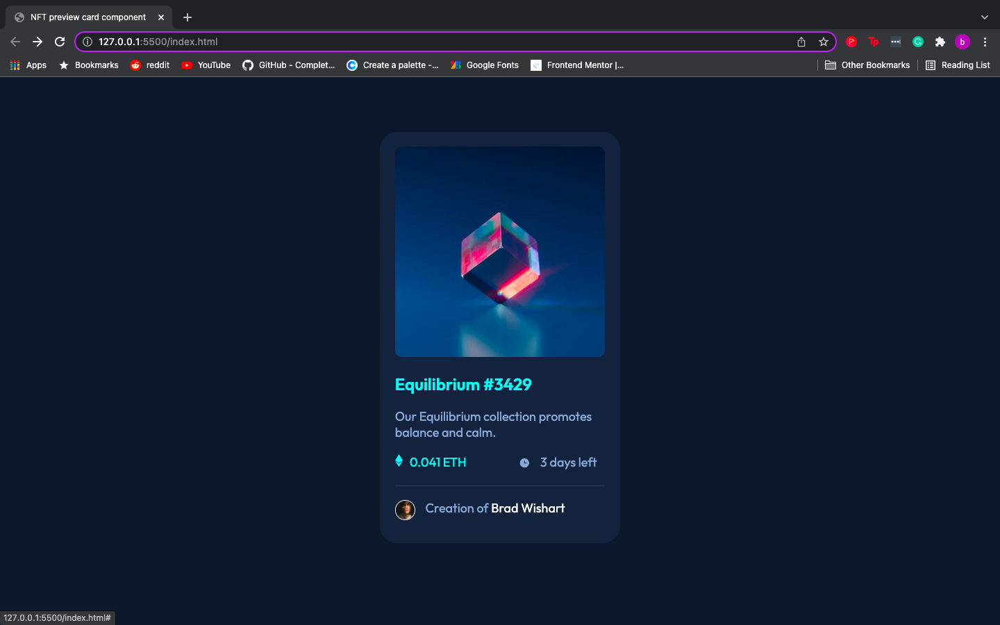

# Frontend Mentor - NFT preview card component solution

This is a solution to the [NFT preview card component challenge on Frontend Mentor](https://www.frontendmentor.io/challenges/nft-preview-card-component-SbdUL_w0U). Frontend Mentor challenges help you improve your coding skills by building realistic projects.

## Table of contents

- [Overview](#overview)
  - [The challenge](#the-challenge)
  - [Screenshot](#screenshot)
  - [Links](#links)
- [My process](#my-process)
  - [Built with](#built-with)
  - [What I learned](#what-i-learned)
  - [Continued development](#continued-development)
  - [Useful resources](#useful-resources)
- [Author](#author)

## Overview

### The challenge

Users should be able to:

- View the optimal layout depending on their device's screen size
- See hover states for interactive elements

### Screenshots

Below I have included three screenshots of the NFT preview card to show the different hover states.




### Links

- Solution URL:(https://www.frontendmentor.io/solutions/nft-preview-card-ZMmoHHq5z)
- Live Site URL:(https://bradwishart.github.io/NFT-Preview-Card/)

## My process

- Initial Planning

To begin this challenge I started by reviewing the design files, after this I could then decide the styles and classes to use throught the project. I find it easier to look at the layers and work my way backwards to find the starting point. This helps me to understand how the project will be structured, and in what order to implement elements.

- First Phase

Firstly I set up a live view of the web page and have my screen split so I can view my code and the web page simultaneously.

The first phase is to write out all of my HTML in a very basic form, this gives me a template to work with and build on.
At first I like to add the main elements to the page in order, starting from top to bottom in a structured way so I have something to look at.

- Second Phase

As the HTML starts to take shape, the next step is to add the CSS Style sheet. I prefer to work with my CSS in an external way, as it is more clear for me to have HTML and CSS on seperate pages.

Now I am able to start adding basic styles and colours to the HTML so it becomes more visually accurate to the reference images. The whole time I am applying HTML and CSS I refer back to the design images to ensure my project is as close as possible.

- Third Phase

Now I begin to add code that makes the web page responsive, using the flex-box model.

- Summary

During this project I faced some difficulties that I will cover in another section, but I ensured that before I moved onto the next section of the project, I was 100% happy with the code and content I had produced. This way there is no confusion when you come back to your code, and you can move onto the next step with a clear mind.

### Built with

- Visual Studio Code
- Emmet Toolkit
- Semantic HTML5 markup
- CSS custom properties
- Flexbox

### What I learned

This project was the first project that I have completed after a few weeks of studying HTML and CSS through various YouTube videos and the Free Code Camp courses. I have genuinely learnt so many new concepts and how to actually apply them. But not only that, I've learned that I'm capable of much more than I thought. Even though this may be a simple project, it's reinforced alot of the basic principles I've learned so far. I am pround of myself for completing it!

I faced many difficulties during this challenge, but through perseverence and self motivation I managed to figure out or find the answers to my roadblocks by myself.

- - I've learned:

- If im faced with a problem I am more than capable of researching to find the answer and able to implement it into my code.

- I can try new concepts within a project and not be afraid to get it wrong.

- How to use the flexbox method to create responsive web pages.

Below is an example of some CSS I wrote to create a container for the whole page to make it responsive and to center the content:

```css
#container {
  height: 100vh;
  display: flex;
  justify-content: center;
  overflow-wrap: break-word;
}
```

- How to overlay images using a div to contain all of the elements.

Below is a snippet of CSS for the blue overlay you see when you hover over the main cube image:

```css
#cube_overlay {
  position: absolute;
  top: 0;
  left: 0;
  height: 98%;
  width: 100%;
  opacity: 0;
  border-radius: 10px;
  background-color: hsl(178, 100%, 50%);
}
```

- How to apply the ":hover" state with CSS in my project:

```css
#img_container:hover #cube_overlay {
  opacity: 0.3;
```

### Continued development

Some things I would like to continue learning and developing are:

- The CSS flexbox and Grid models.
- Responsive web design.
- Improving my workflow and speed.
- Writing more clear and concise code thats easy for anyone to understand.
- How to display web pages that look good on any device.

### Useful resources

- [Wrapping Text Resource](https://developer.mozilla.org/en-US/docs/Web/CSS/CSS_Text/Wrapping_Text) - This helped me to make sure my text wasn't spilling out of the main content box while the web page was being resized.

- [Image Overlay Resource](https://www.w3schools.com/howto/howto_css_image_overlay_icon.asp) - This resource really helped me to understand how to ovrelay images within CSS.

- [Free Code Camp Resource](https://www.freecodecamp.org/learn) - This is where I've been learning the basics of HTML & CSS.

## Author

- Brad Wishart
- Git Hub - [bradwishart] (https://github.com/bradwishart)
- Frontend Mentor - [@bradwishart](https://www.frontendmentor.io/profile/bradwishart)
